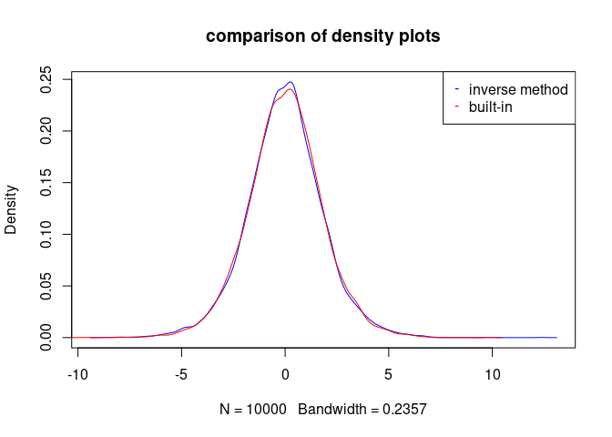
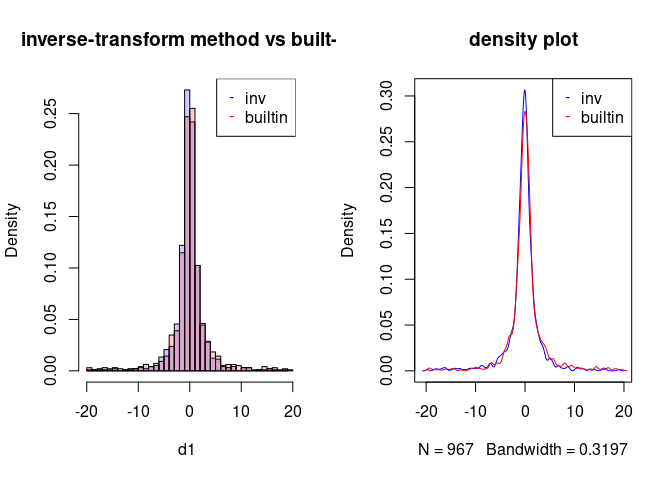
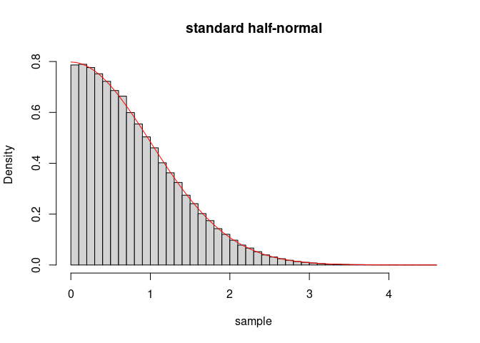
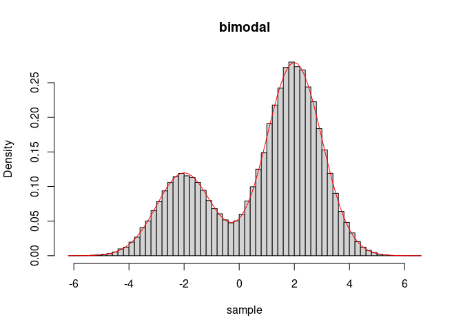

# Problem 1

This is a test

Write your own code and find solution to the equation
*x*3 + *x* − 4 = 0 using Newton’s method and the secant
method. Compare the number of iterations needed for different starting
values for the two methods.

## Solution: Newton’s method

If we have some function *f* : ℝ ↦ ℝ and we wish to find a root of *f*,
i.e., an *x* such that *f*(*x*) = 0, we may use Newton’s method.

We take an initial guess of the root as *x*0 and try to
refine it with a linear approximation of *f* given by
*L*(*f*|*x*0) = *λ**x*.*f*(*x*0) + *f*′(*x*0)(*x* − *x*0).

Now, we may approximate a root of *f* with a root of
*L*(*f*|*x*0),
*L*(*f*|*x*0)(*x*) = 0,
which may be rewritten as
*f*(*x*0) + *f*′(*x*0)(*x* − *x*0) = 0.
Solving for a root *x* of *L*(*f*|*x*0) we get the result
$$
  x = x\_0 - \\frac{f(x\_0)}{f'(x\_0)}.
$$

Hoping that *x* results in a better approximation of the root of *f*
than *x*0, we approximate *f* with *L*(*f*|*x*) and repeat
the process.

Generalizing this result, we obtain the iterative procedure
$$
  x\_{i+1} = x\_i - \\frac{f(x\_i)}{f'(x\_i)}.
$$
We continue this process until we obtain some stopping condition, e.g.,
|*x**i* + 1 − *x**i*| &lt; *ϵ*.

Letting *f*(*x*) = *x*3 + *x* − 4 and
*f*′(*x*) = 3*x*2 + 1 and substituting into the above result,
we get the result
$$
  x\_{i+1} = x\_i - \\frac{x\_i^3+x\_i-4}{3x\_i^2+1}.
$$

We implement a general procedure for Newton’s method:

    newton_method <- function(f,dfdx,x0,eps=1e-3, debug=T)
    {
      n <- 0
      repeat
      {
        x1 <- x0 - f(x0) / dfdx(x0)
        n <- n + 1
       
        if (debug==T) { cat("iteration=",n," x=",x1,"\n") }
        if(abs(x1 - x0) < eps) { break }
        x0 <- x1
      }
      list(root=x0,iter=n)
    }

We take an initial guess of *x*0 = 1 and
*ϵ* = 1 × 10 − 6 and run the following R code to solve for a
root of *f* using Newton’s method:

    f <- function(x) { x^3 + x - 4 }
    dfdx <- function(x) { 3*x^2 + 1 }
    eps <- 1e-6
    x0 <- 1
    result <- newton_method(f,dfdx,x0,eps)

    ## iteration= 1  x= 1.5 
    ## iteration= 2  x= 1.387097 
    ## iteration= 3  x= 1.378839 
    ## iteration= 4  x= 1.378797 
    ## iteration= 5  x= 1.378797

We obtain *x* ≈ 1.3787967 after 5 iterations. When we plug that
approximate root into *f* we obtain the result
*f*(1.3787967) = 7.3825959 × 10 − 9, which is approximately
zero.

## Solution: Secant method

In Newton’s method, we linearize *f* using the derivative of *f*. If,
instead, we use the secant of *f* with respect to two inputs
*x**i* and *x**i* + 1, as given by
$$
  \\frac{f(x\_{i+1}) - f(x\_i)}{x\_{i+1}-x\_i},
$$
we get the iterative procedure
$$
  x\_{i+2} = x\_{i+1} - f(x\_{i+1})\\frac{x\_{i+1}-x\_i}{f(x\_{i+1}) - f(x\_i)},
$$
which requires two initial values *x*0 and *x*1.

We define the secant method as a function given by:

    secant_method <- function(f,x0,x1,eps,debug=T)
    {
      n <- 0
      repeat
      {
        x2 <- x1 - f(x1) * (x1 - x0) / (f(x1) - f(x0))
        n <- n + 1
        
        if (debug==T) { cat("iteration=",n," x=",x2,"\n") }
        
        if(abs(x2-x1) < eps)
        {
          break
        }
        x0 <- x1
        x1 <- x2
      }
      
      list(root=x1,iter=n)
    }

We let *x*0 = 0, *x*1 = 1, and keep everything
else the same and run the secant method with the following R code:

    x0 <- 0
    x1 <- 1
    result <- secant_method(f,x0,x1,eps,F)

We obtain *x* ≈ 1.3787965 after 7 iterations. When we plug that
approximate root into *f* we obtain the result
*f*(1.3787965) =  − 1.268648 × 10 − 6, which is approximately
zero.

Note that this is 2 more iterations than Newton’s method.

## Comparison of Newton’s method versus secant method

We perform 10000 trials to get a better view of how the two methods,
Newton and secant, compare over many different initial guesses.

We generate the data with:

    n <- 10000
    from <- 0
    to <- 4
    by <- (to-from)/n
    newt_sols <- vector(length=n)
    sec_sols <- vector(length=n)
    i <- 1
    for (x0 in seq(from=from, to=to, by=by))
    {
      newt_sols[i] <- newton_method(f,dfdx,x0,eps,F)$iter
      sec_sols[i] <- secant_method(f,x0,x0+1,eps,F)$iter
      i <- i + 1
    }

We summarize the results and report them with:

    cat("mean iterations\n",
        "newton => ", mean(newt_sols), "\n",
        "secant => ", mean(sec_sols), "\n")

    ## mean iterations
    ##  newton =>  5.819618 
    ##  secant =>  7.231077

We see that Newton’s method, on average, requires 1.4114589 fewer
iterations before the stopping condition is satisfied.

# Problem 2

Poisson regression. The Ache hunting data set has *n* = 47 observations
recording is the number of monkeys killed over a period of days with
each hunter along with hunter’s age. It is of interest to estimate and
quantify the monkey kill rate as a function of hunter’s age. Hunting
prowess confers elevated status among the group, so a natural question
is whether hunting ability improves with age, and at which age hunting
ability is best.

Hand-code Newton-Raphson in R to fit the Poisson regression model
`monkeys`*i* ∼ Poi (exp(log`days`*i*+*θ*1+*θ*2`age`*i*+*θ*3`age`*i*2)).

Feel free to use jacobian and hessian in the numDeriv R package. You may
need a sets of crude starting values. I run a linear regression for the
“empirical log-rates” and get starting values (5.99, 0.167, 0.001). Feel
free to use those. Compare your result with glm() function in R using

    glm(monkeys~age+I(age^2), family="poisson", offset=log(days), data=d)

## Solution

We are given the following data:

    d <- read.table("ache.txt", header=T) 
    n <- length(d$age)
    X <- cbind(rep(1,n), d$age, d$age^2)

    loglike <- function(theta)
    {
      sum(dpois(d$monkeys,exp(log(d$days)+X%*%theta),log=T))
    }

We generalize the univariate Newton’s method in Problem 1 to the
multivariate case. We implement the multivariate Newton-Raphson method
with numerical hessian and jacobian with the following R code:

    library(numDeriv)
    newton_raphson_method <- function(x0,f,eps)
    {
      n <- 0
      x1 <- x0
      repeat
      {
          x1 <- x0 - solve(hessian(f,x0))%*%t(jacobian(f,x0))
          n <- n + 1
          if (n %% 7 == 0) { cat("iteration=",n," theta=",x1,"\n") }
          if (max(abs(x1 - x0)) < eps)
          {
            break
          }
          x0 <- x1
      }
      list(root=x1,iter=n)
    }

We use the multivariate Newton-Raphson method to find the MLE of *θ* in
the poisson regression model:

    eps <- 1e-6
    theta0 <- c(5.99, 0.167, 0.001) # starting values
    theta_mle <- newton_raphson_method(theta0,loglike,eps)$root

    ## iteration= 7  theta= -1.010796 0.1670265 0.0009997816 
    ## iteration= 14  theta= -7.590453 0.1532517 0.001112145 
    ## iteration= 21  theta= 1.438485 -0.2696712 0.003827085 
    ## iteration= 28  theta= -5.484246 0.1246477 -0.001203418

The MLE of *θ* is given by:

    theta_mle

    ##              [,1]
    ## [1,] -5.484245905
    ## [2,]  0.124647667
    ## [3,] -0.001203418

We compare the results with the builtin method:

    glm(monkeys~age+I(age^2),family="poisson", offset=log(days),data=d)$coefficients

    ##  (Intercept)          age     I(age^2) 
    ## -5.484245904  0.124647667 -0.001203418

The hand-coded approach and the builtin approach obtain the same point
estimate *θ̂* = ( − 5.4842, 0.1246,  − 0.0012)′.

# Problem 3

Logistic and Cauchy distributions are well-suited to the inverse
transform method. For each of the following, generate 10, 000 random
variables using the inverse transform. Compare your program with the
built-in R functions rlogis() and rcauchy(), respectively:

## Solution: part (a)

Standard logistic distribution
$$
  F(x) = \\frac{1}{1+e^{-x}}
$$

Solve for *x* in
$$
  u = F(x)\\\\
$$
$$
  u = \\frac{1}{1+e^{-x}}\\\\
$$
*x* = log (*u*/(1 − *u*)).

    n <- 10000
    us <- runif(n)
    d1 <- density(log(us/(1-us)))
    d2 <- density(rlogis(n))
    plot(d1,col="blue",main="comparison of density plots")
    lines(d2,col="red")
    legend(x="topright",legend=c("inverse method","built-in"),col=c("blue","red"),
           pch=c("-","-"))

## Solution: part (b)

Standard Cauchy distribution
$$
  F(x) = \\frac{1}{2} + \\frac{1}{\\pi} \\operatorname{arctan(x)}
$$

Solve for *x* in
*u* = *F*(*x*)
$$
  u = \\frac{1}{2} + \\frac{1}{\\pi} \\operatorname{arctan(x)}
$$
*x* = tan (*π*(*u* − 1/2)).

    n <- 1000
    us <- runif(n)
    d1 <- tan(pi*(us-0.5))
    d2 <- rcauchy(n=n)

    d1 <- d1[d1 > -20 & d1 < 20]
    d2 <- d2[d2 > -20 & d2 < 20]

    c1 <- rgb(0,0,255, max = 255, alpha = 50, names = "blue")
    c2 <- rgb(255,0,0, max = 255, alpha = 50, names = "red")

    par(mfrow=c(1,2))
    hist(d1,col=c1,freq=F,breaks=50,main="inverse-transform method vs built-in")
    hist(d2,col=c2,add=T,freq=F,breaks=50)
    legend(x="topright",legend=c("inv","builtin"),col=c("blue","red"),pch=c("-","-"))
    plot(density(d1), col="blue",main="density plot")
    lines(density(d2), col="red") 
    legend(x="topright",legend=c("inv","builtin"),col=c("blue","red"),pch=c("-","-"))

# Problem 4

Generating 10, 000 random variables from Geometric (*p*) distribution
based off Bernoulli trials.

## Solution

A random variable *X* ∼ Geometric(p)  is given by the number of i.i.d.
trials needed to have a success where success occurs with probability
*p*.

Thus, we may simulate this distribution with the following R code:

    # simulate n realizes of geometric(p)
    rgeo <- function(n,p)
    {
      outcomes <- vector(length=n)
      for (i in 1:n)
      {
        trials <- 0
        while (T)
        {
          trials <- trials + 1
          if (rbinom(1,1,p) == 1)
          {
            break
          }
        }
        outcomes[i] <- trials
      }
      outcomes
    }

When we use this function to draw a sample of *n* = 10000 geoemtrically
distributed random variables with *p* = 0.2, we obtain:

    p <- .2
    n <- 10000
    sample <- rgeo(n,p)
    cat("the mean should be approximate 1/p =", 1/p, " and we obtain a mean of ", mean(sample))

    ## the mean should be approximate 1/p = 5  and we obtain a mean of  4.9515

# Problem 5

Generate random values from a Standard Half Normal distribution with
pdf,
$$
f(x) = \\frac{2}{\\sqrt{2 \\pi}} e^{-x^2/2} , x &gt; 0.
$$

For the candidate pdf, choose the exponential density with rate 1.
Verify that your method works via a plot of the true density, and a
histogram of the generated values.

## Solution

We are given the density of the standard half-normal distribution,
$$
  \\operatorname{dhalfnormal}(x) = \\frac{2}{\\sqrt{2 \\pi}} e^{-x^2/2}, x &gt; 0.
$$

We model this density with the following R code:

    # density for standard half-normal
    dhalfnormal <- function(x) { 2/sqrt(2*pi)*exp(-x^2/2) }

We sample from the exponential distribution EXP (*λ* = 1), with density
*g* and thus we first find the *c* satisfying
$$
  c = \\max \\left\\{ \\frac{\\operatorname{dhalfnormal}(x)}{\\operatorname{dexp}(x|\\lambda=1)} | x \\in \\mathbb{R} \\right\\},
$$
which is found to be approximately *c* = 1.315489247.

We implement the standard half-normal sampler, rhalfnormal , using the
acceptance-rejection sampling technique with the following R code:

    # accept-rejection sampling for standard half-normal
    # using exp(rate=1)
    rhalfnormal <- function(N)
    {
      c <- 1.315489247
      xs <- vector(length=N)
      k <- 1
      while (T)
      {
        x <- rexp(n=1)
        if (runif(n=1) < dhalfnormal(x)/(c*dexp(x)))
        {
          xs[k] <- x
          k <- k + 1
          if (k == N)
          {
            break
          }
        }
      }
      xs
    }

We simulate drawing *n* = 100000 samples from the standard half-normal
distribution and plotting a histogram of the sample with its density
overload in red on top of it with the following R code:

    n <- 100000
    sample <- rhalfnormal(n)
    hist(sample,freq=F,breaks=50,main="standard half-normal")
    curve(dhalfnormal(x),add=TRUE,col="red") 

We see that the histogram is compatible with being drawn from the
overload density.

# Problem 6

Use accept-reject to sample from this bimodal density:
*f*(*x*) ∝ 3*e* − 0.5(*x* + 2)2 + 7*e* − 0.5(*x* − 2)2
The normalizing constant is 25.066. For your proposal *g*( · ), use a
*N*(0, 22) distribution. Verify that your method works via a
plot of the true normalized density, and a histogram of the generated
values.

## Solution

We are given the kernel of the bimodal distribution of interest,
ker-bimodal (*x*) = 3*e* − 0.5(*x* + 2)2 + 7*e* − 0.5(*x* − 2)2,
with the normalizing constant *C* = 25.0663 and thus the pdf for the
bimodal is given by
$$
  \\operatorname{dbimodal}(x) = \\frac{\\operatorname{ker}(x)}{C}.
$$

We model these two functions with the following R code:

    # density for biomodal density
    kerbimodal <- function(x) { 3*exp(-0.5*(x+2)^2) + 7*exp(-0.5*(x-2)^2) }
    kerbimodal.C <- 25.0663
    dbimodal <- function(x) { kerbimodal(x) / kerbimodal.C }

We sample from the normal distribution
*N*(*μ* = 0, *σ*2 = 22), with density *g* and thus
we first find the *c* satisfying
$$
  c = \\max \\left\\{ \\frac{\\operatorname{ker-bimodal}(x)}{g(x|\\mu=0,\\sigma^2=2^2)} | x \\in \\mathbb{R} \\right\\},
$$
which is found to be approximately *c* = 68.35212.

We implement the bimodal sampler, rbimodal , using the
acceptance-rejection sampling technique with the following R code:

    # accept-rejection sampling for bimodal distribution with density dbimodal
    # using normal(0,2^2).
    rbimodal <- function(N)
    {
      c <- 68.35212
      xs <- vector(length=N)
      k <- 1
      while (T)
      {
        x <- rnorm(n=1,mean=0,sd=2)
        if (runif(n=1) < kerbimodal(x)/(c*dnorm(x,mean=0,sd=2)))
        {
          xs[k] <- x
          if (k == N)
          {
            break
          }
          k <- k + 1
        }
      }
      xs
    }

We simulate drawing *n* = 100000 samples from the bimodal distribution
and plotting a histogram of the sample with its density overload in red
on top of it with the following R code:

    n <- 100000
    sample <- rbimodal(n)
    hist(sample,freq=F,breaks=50,main="bimodal")
    curve(dbimodal(x),add=TRUE,col="red") 

We see that the histogram is compatible with being drawn from the
overload density.
