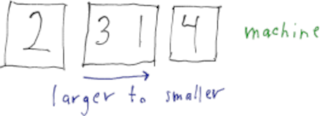

# Problem 1
> The surface finish of metal parts made on $a=4$ machines is under
> investigation.
> Each machine can be run by one of $b=3$ operators.
> Because of the location of the machines, operators are specific to a
> particular machine.
> Therefore, a nested design with fixed factors is used.
> Each operator produces $n=2$ samples.
> The data is availabe on Blackboard as an Excel File.

## Part (a)
> Explain the difference between crossed factors and nested factors.

Factors $A$ and $B$ are *crossed* in an experimental design if the levels of $B$
are the same at each level of $A$.

Factor $B$ is *nested* within factor $A$ if the levels of $B$ are different
for each of the levels of factor $A$.

## Part (b)
> Write the model for a nested design.
> Provide algebraic formulas for the estimates $\hat{\tau}_i$ and $\hat{\beta})_{j(i)}$.

Given that $A$ and $B$ are fixed factors,
$$
  Y_{i j k} = \mu + \tau_i + \beta_{j(i)} + \epsilon_{i j k}
  \begin{cases}
    i = 1,\ldots,a\\
    j = 1,\ldots,b\\
    k = 1,\ldots,n
  \end{cases}
$$
where $\{\tau_i\}$ ($\sum_i \tau_i = 0$) with $\df{A}=a-1$
and $\{\beta_(j(i))\}$ ($\sum_j \beta_{j(i)} = 0$ for $i=1,\ldots,a$) with
$\df{B} = a(b-1)$ are fixed effects.

Estimators are given by
$$
  \hat{\tau}_i = \bar{Y}_{i\cdot\cdot} - \bar{Y}_{\cdot\cdot\cdot}
$$
and
$$
  \hat{\beta}_{j(i)} = \bar{Y}_{i j \cdot} - \bar{Y}_{i \cdot\cdot}.
$$

We see that level factors of $A$ are compared with $\{\hat{\tau}_i\}$ while level
factors of $B$ are compared only with the same level of $A$, e.g., at the $i$-th
level of $A$, level factors of $B$ are compared with $\{\beta_j(i) \}$.

## Part (c)
> Compute the $F_A$ statistic for testing factor $A$ effects, and the $F_{B(A)}$
> statistic for testing nested factor $B$ effects.
> Compute the $p$-values.
> Provide an overall interpretation, stated in the context of the problem.

For fixed factor $A$ and fixed factor $B$ nested in $A$,
$$
  F_A = \ms{A} / \ms{E}
$$
and
$$
  F_{B(A)} = \ms{B(A)} / \ms{E}
$$
where
\begin{align*}
  \ms{A} &= \frac{b n \sum_{i=1}^{a} \hat{\tau}_i^2 }{a-1},\\
  \ms{B(A)} &= \frac{n \sum_{i=1}^{a} \sum_{j=1}^{b} \hat{\beta}_{j(i)}^2}{a(b-1)},\\
  \ms{E} &= \frac{\sum_{i=1}^{a} \sum_{j=1}^{b} \sum_{k=1}^{n}
    (Y_{i j k} - \bar{Y}_{i j \cdot})}{a b (n-1)}.
\end{align*}

Under the model $\tau_1 = \cdots \tau_a = 0$,
$$
  F_A \sim F(\df{A},\df{E}) = F(a-1,a b (n-1))
$$
and under $\beta_{j(i)} = 0$ for all $i,j$,
$$
  F_{B(A)} \sim F(\df{B(A)},\df{E}) = F(a(b-1),a b (n-1)).
$$

We perform these computations in R with:
```{r}
library("readxl")
data = read_excel("handout9data.xlsx")
A = as.factor(na.omit(data$mchine))
B = as.factor(na.omit(data$operator))
y = na.omit(data$surface)

# use contrasts to define parameter restrictions for the fixed effects in the
# model
contrasts(A)=contr.sum
contrasts(B)=contr.sum

# to fit a model with a nested fixed effect, we use the / notation within the
# aov command.
nested.mod = aov(y ~ A/B)
summary(nested.mod) # compute F statistics for factor effects
```

We see that $F_A = 14.271$ ($p$-value $= .000$) and $F_{B(A)} = 4.168$
($p$-value $= .013$).

### Interpretation

The experiment finds that the machine has an effect on surface finish.
Also, the experiment finds that the operators within a machine has an effect
on surface finish.

## Part (d)
> Compute estimates for each of the effect parameters.
> Identify which machine performs best, and which operator performs best on each
> machine. (Higher scores of response are preferred.)

### Comparing machines

```{r, message=F}
# compute parameter estimates
estimates = dummy.coef(nested.mod)
estimates$A

library("multcomp")
# The following commands are used to perform pairwise comparisons between machines.
# The glht command should be familiar from previous sections on multiple comparisons.
compare.A = glht(nested.mod,linfct = mcp(A="Tukey"))
c.m = summary(compare.A,test=adjusted("none"))
c.m
cld(c.m)
```

When we look at the output, we see that group $a$ (machine 4) is less than
groups $b$ (machine 1 and 3) and $c$ (machine 2), and group $b$ is less than
group $c$.

So, we have machine 4 as the worst, machines 1 and 3 as equal and better than
machine 4, and machine 2 as the best.

We summarize with a picture:



### Comparing machine $\times$ operator
```{r, message=F, eval=F}
library("lsmeans")
# comparisons only involving operators (B) within machines (A)
x.mod = aov(y~A*B)
lsmeans(x.mod, pairwise ~ A:B, adjust="none")
```

Okay, there was a lot there (so I suppressed the output), but we're only looking
at comparisons of operators per machine:

| test      | est   | $p$    |
| --------- | ----- |------- |
| 1 1 - 1 2 | -13.5 | 0.1677 |
| 1 1 - 1 3 | 19.0  | 0.0610 |
| 1 2 - 1 3 | 32.5  | 0.0041 |
| --------- | ----- | ------ |
| 2 1 - 2 2 | 13.5  | 0.1677 |
| 2 1 - 2 3 | 23.5  | 0.0252 |
| 2 2 - 2 3 | 10.0  | 0.2980 |
| --------- | ----- | ------ |
| 3 1 - 3 2 | 27.0  | 0.0124 |
| 3 1 - 3 3 | 30.0  | 0.0068 |
| 3 2 - 3 3 | 3.0   | 0.7500 |
| --------- | ----- | ------ |
| 4 1 - 4 2 | -3.5  | 0.7100 |
| 4 1 - 4 3 | -10.0 | 0.2980 |
| 4 2 - 4 3 | -6.5  | 0.4930 |

The best operator in machine $1$ is operator $2$.

The best operator in machine $2$ is operator $1$.
(There is some evidence that operators $1$ and $2$ may have the same effect,
though).

The best operator in machine $3$ is operator $1$.

The best operator in machine $4$ is operator $3$.
This last one is the most problematic, since the data is compatible with
all of them having the same effect, but if we had to choose one, it would be
operator $3$.

## Part (e)
> Explain why it is not possible to directly compare operators across machines
> in the above design.

We cannot directly compare operators (factor $B$ levels) across machines (factor
$A$ levels) since we only have data for operator performance with respect to a
particular machine ($A$ level).

However, we can compare operators within the same machine, or compare
operator $\times$ machine combinations.

# Problem 2
> A nested design is used to study the burning rate of propellant from three
> production processes (fixed effect, factor $A$).
> Four batches of propellant are randomly selected from each of the processes
> (random effect, factor $B$), and $n=3$ determinations of burning rate are made
> on each batch.
> The data is availabe on Blackboard as an Excel File.

## Part (a)
> Provide the algebraic formulas for $\ms{A}$, $\ms{B(A)}$, and $\ms{E}$.

\begin{align*}
  \ms{A} &= \frac{b n \sum_{i=1}^{a} \hat{\tau}_i }{a-1},\\
  \ms{B(A)} &= \frac{n \sum_{i=1}^{a} \sum_{j=1}^{b} \hat{\beta}_(j(i)}{a(b-1)},\\
  \ms{E} &= \frac{\sum_{i=1}^{a} \sum_{j=1}^{b} \sum_{k=1}^{n}
    (Y_{i j k} - \bar{Y}_{i j \cdot})}{a b (n-1)}.
\end{align*}

## Part (b)
> State the expected value for each of the mean squares.

\begin{align*}
  E(\ms{A})       &= \sigma^2 + n \sigma_{\beta}^2 + \frac{b n}{a-1} \sum_{i=1}^{a} \tau_i^2,\\
  E(\ms{B(A)})    &= \sigma^2 + n \sigma_{\beta}^2,\\
  E(\ms{E})       &= \sigma^2.
\end{align*}

## Part (c)
> Test for differences between the production processes.
> Write the $F_A$ statistic as a ratio of mean squares.
> Compute $F_A$ and the $p$-value.
> Provide an interpretation, stated in the context of the problem.

Under the null model $H_0 : \tau_1 = \cdots = \tau_a = 0$, $\ms{A}$ and
$\ms{B(A)}$ have the same expected value, and thus an appropriate test statistic
for testing evidence of $H_0$ is
$$
  F_A = \frac{\ms{A}}{\ms{B(A)}}.
$$

We load the data in R with:
```{r}
A = as.factor(na.omit(data$proc))
B = as.factor(na.omit(data$batc))
y = na.omit(data$burn_rate)
```

```{r, include=F}
nested.test = function(A,B,y)
{
  av=anova(lm(y~A/B))
  ss.A = av$`Sum Sq`[1]
  ss.B = av$`Sum Sq`[2]
  ss.error = av$`Sum Sq`[3]
  df.A = av$Df[1]
  df.B = av$Df[2]
  df.error = av$Df[3]
  ms.A = ss.A / df.A
  ms.B = ss.B / df.B
  ms.error = ss.error / df.error
  F.a = ms.A / ms.B
  p.value = pf(F.a,df1=df.A,df2=df.B,lower.tail = FALSE)
  table1 = matrix(c(ss.A,ss.B,ss.error,
                    df.A,df.B,df.error,
                    ms.A,ms.B,ms.error),nrow = 3)
  dimnames(table1) = list(c("Fixed Effect A","Random Effect B(A)","Error"),
                          c("SS","df","MS"))
  print(table1)
  
  table2 = matrix(c(F.a,p.value),nrow = 1)
  dimnames(table2) = list(c(""),c("F-test for fixed effect","p-value"))
  print(table2)
  
  a=nlevels(A)
  b=nlevels(B)
  n=length(y) / a / b
  
  var.hat = ms.error
  var.B.hat = (ms.B - ms.error) / n
  
  table3 = matrix(c(var.hat,var.B.hat),nrow=1)
  dimnames(table3) = list(c(""),c("error.var","B.var"))
  print(table3)
}
```

We compute $F_A$ in R with:
```{r}
nested.test(A,B,y)
```

We see that $F_A = 1.464$ ($p$-value $= .281$).

### Interpretation
The experiment finds that production process does not have an effect on the
burning rate of propellant.

## Part (d)
> Explain why $\ms{E}$ is the incorrect error term to use when the nested factor
> is random.
> In particular, comment on the pertinent sample size.

I touched on this in part (c) ($\ms{A}$ and $\ms{B(A)}$ have the same expected
value under the null model $\tau_1 = \cdots = \tau_a = 0$).

In addition, we may also think of the batch as the experimental unit and thus
the appropriate error term is then a measure of batch variance.

Finally, taking repeat measurements on each random factor level does not
increase the pertinent sample size.

## Part (e)
> Illustrate how evidence in favor of a process effect would be overstated if
> $\ms{E}$ is used when computing the test statistic.

Under the null model, $H_0 : \tau_1 = \cdots = \tau_a = 0$,
$E(\ms{A}) = \sigma^2 + n \sigma_{\beta}^2$, and $E(\ms{E}) = \sigma^2$.
The reference distribution $F(\df{A},\df{E})$ assumes the
numerator and denominator have the same expected value under $H_0$, thus the
test statistic
$$
  \frac{\ms{A}}{\ms{E}}
$$
will be inflated and consequently overstates the effect of the process (factor
$A$).

More generally, since $n \sigma_{\beta}^2 > 0$, even if $H_0$ is not the case,
the significance of the evidence in favor of a process effect will necessarily
be overstated.

## Part (f)
> Compute estimates of the batch variance and the measurement variance.

An estimator for the measurement variance (within batches) is
$\hat{\sigma}^2 = \ms{E}$ and an estimator for the batch variance (between
batches) is given by $\hat{\sigma}_{\beta}^2 = \frac{\ms{B(A)} - \ms{E}}{n}$.

In part (c), `nested.test` showed the outputs
$$
  \hat{\sigma}^2 = 18.917
$$
and
$$
  \hat{\sigma}_{\beta}^2 = 70.642.
$$

# Appendix: Code

```{r, eval=F}
# Suppose we want R to give us the results we developed in the notes. 
# Below is a user defined function to perform those computations.
nested.test = function(A,B,y)
{
  av=anova(lm(y~A/B))
  ss.A = av$`Sum Sq`[1]
  ss.B = av$`Sum Sq`[2]
  ss.error = av$`Sum Sq`[3]
  df.A = av$Df[1]
  df.B = av$Df[2]
  df.error = av$Df[3]
  ms.A = ss.A / df.A
  ms.B = ss.B / df.B
  ms.error = ss.error / df.error
  F.a = ms.A / ms.B
  p.value = pf(F.a,df1=df.A,df2=df.B,lower.tail = FALSE)
  table1 = matrix(c(ss.A,ss.B,ss.error,
                    df.A,df.B,df.error,
                    ms.A,ms.B,ms.error),nrow = 3)
  dimnames(table1) = list(c("Fixed Effect A","Random Effect B(A)","Error"),
                          c("SS","df","MS"))
  print(table1)
  
  table2 = matrix(c(F.a,p.value),nrow = 1)
  dimnames(table2) = list(c(""),c("F-test for fixed effect","p-value"))
  print(table2)
  
  a=nlevels(A)
  b=nlevels(B)
  n=length(y) / a / b
  
  var.hat = ms.error
  var.B.hat = (ms.B - ms.error) / n
  
  table3 = matrix(c(var.hat,var.B.hat),nrow=1)
  dimnames(table3) = list(c(""),c("error.var","B.var"))
  print(table3)
}
```

